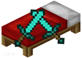

</img>

# 
BedWar     起床战争 

**Anmerkung:**
Übersetzt mit google translate

**Einführung:**
Im Spiel starten die Spieler einen völlig anderen Wettbewerb in Form von Team-PVP. Der Zweck des Spiels ist es, dass die Spieler ihre eigenen Betten vor der Zerstörung im Spiel schützen. Also müssen sie zusammenarbeiten und sich darauf verlassen, dass Teamkollegen zusammenarbeiten, um die Betten des Gegners im Spiel zu zerstören, was als Sieg im Spiel angesehen wird!

Spielfunktionen:
1. Die Spieler werden in vier Teams mit 16 Spielern aufgeteilt, um gegeneinander zu kämpfen, der Zweck ist, ihre eigenen Betten zu schützen;
2. Solange das Bett existiert, können sich die Spieler im Team wiederbeleben, sodass sich ihre Teamkollegen sofort in ihrer besten Verfassung erholen und wieder in den Kampf einsteigen können;
3. Bauen Sie eine Brücke zur feindlichen Insel, dringen Sie in das feindliche Territorium ein und gewinnen Sie den Sieg mit dem ultimativen Ziel, das Bett des Gegners zu zerstören

------

Spielmodus:
  1. **Erfahrungsmodus**
  2. **Gegenstandsaustauschmodus**
  
**Einführung in die Verwendung:**
**1. Plug-in-Start**

1. Kopieren Sie dieses Plugin in den Plugins-Ordner
2. Starten Sie den Server, und warten bis das Plugin geladen ist

3. Nachdem Sie das Spiel betreten haben, führen Sie /bd aus, um mit der Erstellung eines Raums zu beginnen.

**2. Anweisungseinführung**

| Anweisung                | Erläuterung                             |
| ------------------- | -------------------------------- |
| /bd reload          | Konfigurationsdatei erneut lesen                 |
| /bd set [Name]      | Erstellen Sie eine benutzerdefinierte Raumvorlage, und folgen sie den weiteren Anweisungen /bd set [...]  |
| /bd tsl             | Lesen Sie Vorlagenteamdaten und speichern Sie Artikeldaten |
| /bd see             | Räume anzeigen                   |
| /bd close [Name]    | schließe den Raum                         |
| /bd end             | Erstellen der benutzerdefinierte Raumvorlage stoppen/beenden                     |
| /bw                 | das Spiel betreten / GUI                      |
| /bw join [Name]     | Spieleraum beitreten                     |
| /bw quit            | Spiel(zimmer) verlassen                     |
| /bws [Nachricht] | Senden Sie eine Nachricht an alle im Spiel(zimmer)          |

**3. Konfigurationsdatei**
Siehe Ressourcenordner (resources)
------

**4. Konfiguration**

1. Führen Sie /bd set [room name] aus, um die voreingestellte Vorlage zu starten (bitte achten Sie darauf, keine Fehler zu machen, da Sie sonst nur /bd cancel zum Zurücksetzen ausführen können)

#TODO
| ------------------------------------------------------------ | ------------------------------------------------------------ |
|Befolgen Sie die Anweisungen, um die Einstellungen anzupassen                       | Suchen Sie nach Abschluss der Voreinstellung die generierte Datei team.yml, um die Teaminformationen zu ändern, und führen Sie **/bd tsl aus, um die Teamdaten neu zu laden** |
| | Dann /bd set ausführen, um die Anzahl der Spawnpunkte des Items voreinzustellen, und dann /bd ausführen, um die Konfiguration des Raums zu starten **Hinweis: Bitte keine Fehler beim Setzen machen, sonst könnt ihr das Flag nur mit /bd zurücksetzen stornieren. Die Reihenfolge des Store-Geburtspunkts des Teams ist die Reihenfolge der team.yml-Konfigurationsdatei, bitte entsprechend der Reihenfolge einstellen. **|

------

**5. ChangeLog :**

**Aktualisierung 1.3.3 vom 15.05.2022**
\+ Zeitlimit für die automatische Unterbrechung des Schlafens
\+ Beheben Sie den BUG, ​​der auftritt, wenn der Spieler den Spielraum nach dem Verlassen des Spiels wieder betritt
\+ Ändere den /bws-Chat auf alle Nachrichten im Raum, normale Eingabe auf Team-Chat

**Aktualisierung v1.3.4 vom 20.05.2022**
\+ Ändern Sie die standardmäßige Bettzerstörungszeit auf 120 Sekunden
\+ Erhöhen Sie die Erfahrungs-Weckfunktion (ändern Sie die Kupferbarren und Goldbarren im Geld des Ladens in Erfahrung)
\+ Fügen Sie die Konfiguration des Aufsteherlebnisses hinzu. Fügen Sie den Fall am Ende der Datei room.yml hinzu
(Standard ist die Standard-Exp, um für Erfahrung aufzustehen)
Fall:
roomMoney: "exp"
\+ Exp-Währung erhöhen
\+ Sie können exp zur Währung in der item.yml-Datei hinzufügen, um Erfahrung zu entsprechen
Fall:
Geld:
\# Währungsname
\- name: "Kupferbarren"
\# wird nur als Anzeigename verwendet
customName: "&4Kupferbarren"
Eintrag: "336:0"
exp: 1

**Aktualisierung v1.3.5 vom 20.05.2022**
\+ füge zufälligen Befehl zum Beitreten eines Raums hinzu /bd rjoin
\+ Ändern Sie die Team-Eingabeaufforderung zum Erstellen eines Raums
\+ Fügt eine erzwungene Beendigung hinzu. /bw abbrechen

**Aktualisierung v1.3.6 vom 20.05.2022**
\+ Zeigen Sie die Erfahrung, die Sie beim Aufstehen gesammelt haben, in Form von Levels an

**Aktualisierung v1.3.7 vom 20.05.2022**
\+ Repariere den anormalen BUG beim Erstellen eines Raums
\+ Behebt den BUG, ​​der auftritt, wenn zufällige Befehle ausgeführt werden
\+ Repariere den BUG, ​​dass die Items zum Aufwecken der Erfahrung nicht abgezogen werden
\+ Beheben Sie den Fehler beim Erstellen des Raumtextfehlers
\+ Es wurde der Fehler behoben, dass der Preis des Erlebnis-Wake-up-Shop-Artikels nicht das Erlebnis ist

**Aktualisierung v1.3.8 vom 22.05.2022**
\+ Verdorrbogen-Gegenstand hinzugefügt
Beispiel: Fügen Sie item.yml hinzu
"Verdorrener Bogen":
customName: "&eWither Bow"
Überlieferung: []
Eintrag: "261:0"

\+ Erhöhen Sie den Eingabeaufforderungsinhalt, wenn das Spiel beginnt (anpassbar)
\+ Druck der Daten des Siegerteams am Ende des Spiels hinzugefügt
\+ Optimieren Sie die Anzeige von Anzeigetafeln und anderen Inhalten

------

**6. Effekte im Spiel:**

defekte bilder entfernt
